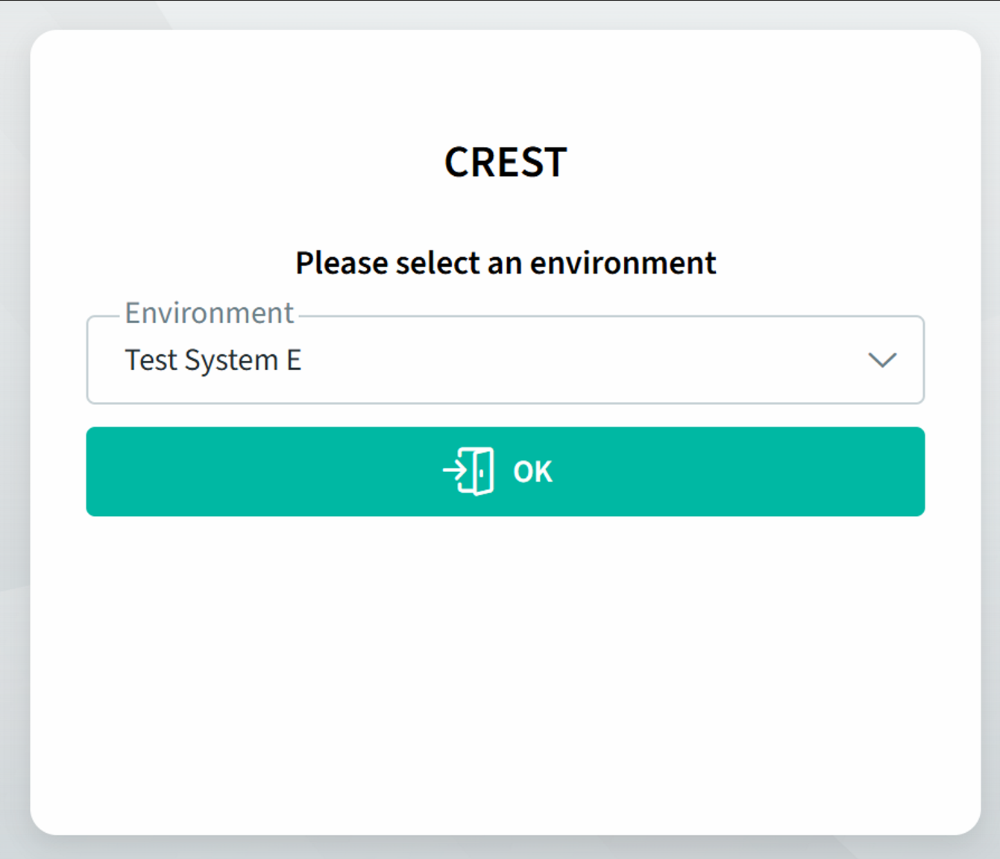
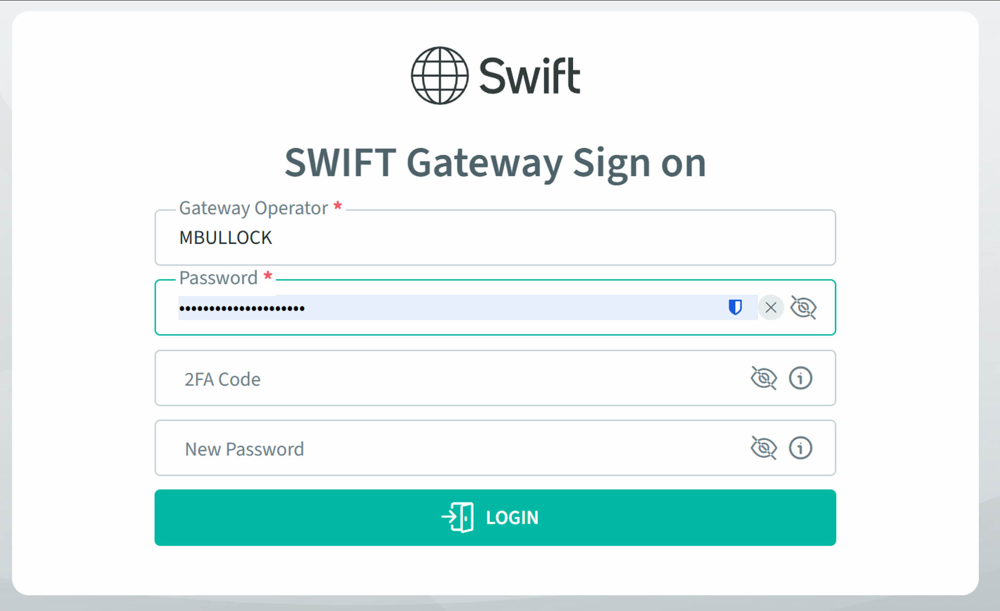
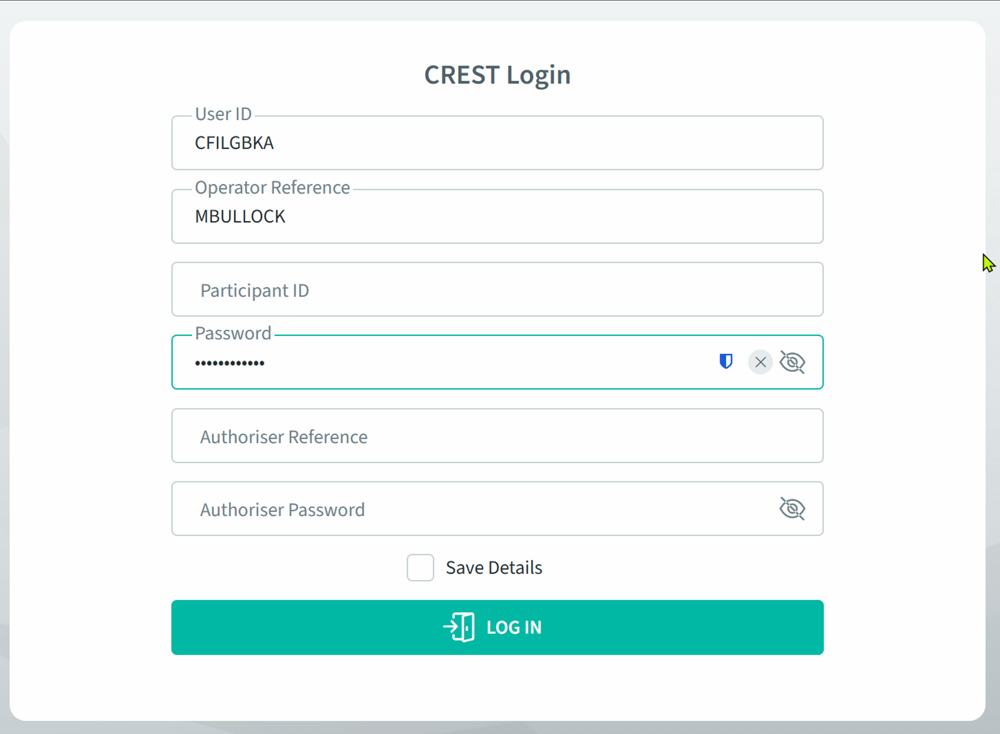

# Crest

This repository captures vendor (Euroclear) documentation and internal notes related to the CREST[^1] system.

There is no application code in this repository; it serves as a reference store for
documentation gathered during any CREST project work.

## Structure

### Core CREST Documentation Content

| Folder | Purpose |
| ------ | ------- |
| `[docs/vendor/](docs/vendor/)` | Vendor-supplied documentation, data sheets, manuals, and reference material |
| `[docs/internal/](docs/internal/)` | Internal notes, decisions, and meeting records |

### Generic Repository Tooling

| File/Folder | Purpose |
| ----------- | ------- |
| `[.githooks/](.githooks/)` | Git hook scripts used for pre-commit and pre-push validation |
| `[scripts/](scripts/)` | Utility scripts used by hooks (e.g., VS Code settings sorting) |
| `[.markdownlint.yaml](.markdownlint.yaml)` | Shared markdownlint rule configuration used by the pre-commit hook |
| `[.gitattributes](.gitattributes)` | Cross-platform line-ending and binary file handling policy |
| `[Makefile](Makefile)` | Optional convenience shortcuts for hook setup, settings sort, and docs lint |

### Tooling Commands (Optional)

If `make` is available, these shortcuts wrap the helper scripts:

```bash
make install-hooks
make settings-sort
make lint-docs
make lint-docs-fix
```

If `make` is not available, run the scripts directly from `scripts/`.

## Access

| Env./Service | <font color="red">Finastra Prod</font> | <font color="green">Finastra DR</font> |
| ------------ | ------------------------------------- | -------------------------------------- |
| <font color="red">PROD</font> | [PROD (Prod)](https://cwg-pr.fundtech-fm.com:39000/Api/welcome?webui=PROD) | [PROD (DR)](https://cwg-dr.fundtech-fm.com:39000/Api/welcome?webui=PROD) |
| ONDEMAND | [ONDEMAND (Prod)](https://cwg-pr.fundtech-fm.com:39000/Api/welcome?webui=ONDEMAND) | [ONDEMAND (DR)](https://cwg-dr.fundtech-fm.com:39000/Api/welcome?webui=) |
| RAT1EXT | [RAT1EXT (Prod)](https://cwg-pr.fundtech-fm.com:39000/Api/welcome?webui=RAT1EXT) | [RAT1EXT (DR)](https://cwg-dr.fundtech-fm.com:39000/Api/welcome?webui=RAT1EXT) |
| RAT2EXT | [RAT2EXT (Prod)](https://cwg-pr.fundtech-fm.com:39000/Api/welcome?webui=RAT2EXT) | [RAT2EXT (DR)](https://cwg-dr.fundtech-fm.com:39000/Api/welcome?webui=RAT2EXT) |
| RAT3EXT | [RAT3EXT (Prod)](https://cwg-pr.fundtech-fm.com:39000/Api/welcome?webui=RAT3EXT) | [RAT3EXT (DR)](https://cwg-dr.fundtech-fm.com:39000/Api/welcome?webui=RAT3EXT) |

Access is a multi-stage process:

1. Connect via one of the Access Links above (e.g. [RAT2](https://cwg-pr.fundtech-fm.com:39000/Api/welcome?webui=RAT2EXT))
2. Pick an Environment, e.g. 'Test System E' (as used in UAT/PAT (Participant Acceptance Testing) pri to go-live)
  
3. Sign-in to the SWIFT Gateway  
  
4. Login to CREST  


> [!IMPORTANT]
> NOTE: The username is likely to be the same on both the SWIFT Gateway sign-on
> and the CREST Login, but does not have to be. The Gateway has no knowledge of
> CREST users and vice versa. For this reason, the passwords are independent as
> well.

## Footnotes

[^1]: Certificateless Registry for Electronic Share Transfer
